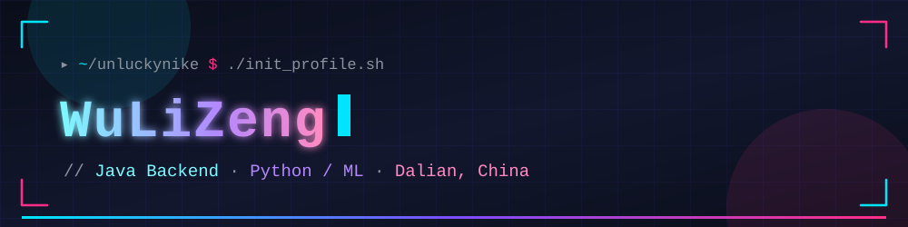

  
  

    
  

  

    
    
  

## ⚡ 技术栈

  
  
  
  
  
   
  
  
  
  
  

## 📊 GitHub 统计

> 卡片由 GitHub Actions 定时生成并提交进本仓库，不依赖任何第三方在线服务，永久可加载。

  <table>
    <tr>
      <td></td>
      <td></td>
    </tr>
    <tr>
      <td></td>
      <td></td>
    </tr>
  </table>

## 🐍 贡献贪吃蛇

  

## 📫 联系我

  
  

