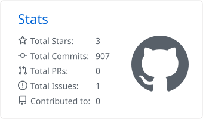
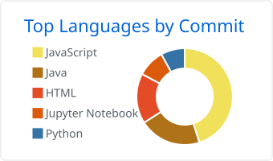

## 你好 👋 我是 **halen**

- 🔭 Java 后端开发，常用 Spring Boot，也写 Vue
- 🌱 正在学习 Go 与机器学习（PyTorch）
- 📝 学习笔记记录在[博客](https://unluckynike.github.io/)
- 📍 成都 · 📫 [2230432084@qq.com](mailto:2230432084@qq.com)

### 🛠 技术栈

### 📊 GitHub 统计

<table>
  <tr>
    <td></td>
    <td></td>
  </tr>
</table>

---

  

